## Configure WEM for a fast and resilient logon time ##

Download the " 	WEM-Config.zip" from GitHub and copy all files in the archive into a "C:\CitrixWEM-install\".

Connect to DNA1 server as the demo admin accounts.

Launch the WEM Administrative Console

Connect to the server "dna1.citrix.lab" and then select the XenApp site to the right.

Click on **Import Settings**

Click **Next**
 
Click on **Browse**
Select “Default Recommended Settings” from 
“C:\CitrixWEM-install\Configuration Templates” folder
 
Click OK button
Check Agent Configuration Settings box,

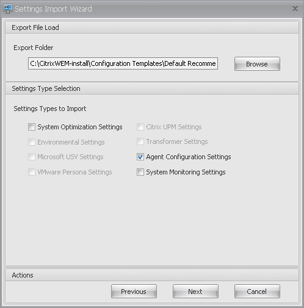
 
Click **Next** button
Click on **Import Setting**s button
 
And Click on **Yes** button on confirmation Window
 
Click on **Finish** button
On WEM management console, click on Advanced Settings => Configuration => Main configuration tab:

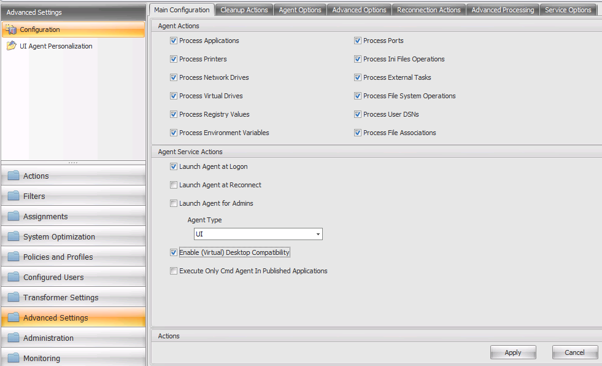
 
You have access to the WEM agent configuration. In this template, Agent will be launch at any user login, not for admin
Check automatic refresh setting in Advanced Options tab, and change it to **15 min**
 
Click Apply **button**
Go to Configured users

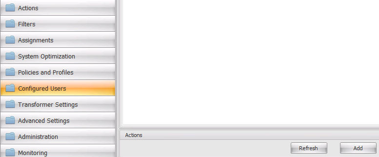

Click **Add** button
Enter “user” and click Check Names

Select User1, User2, User3
 
Click **OK**
 
Click **OK**
Use **Add** button again, and add “domain users”.
You will obtain this final result: 

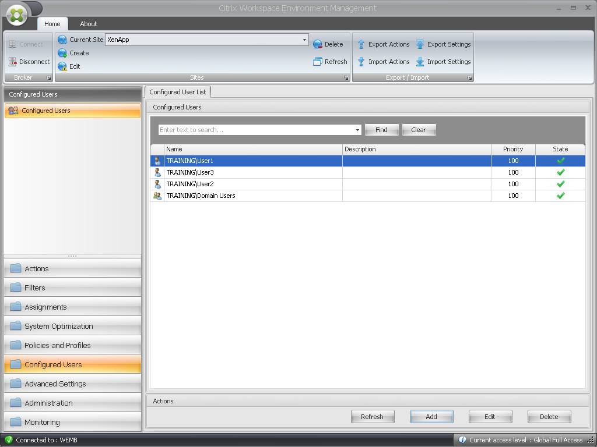
 
Go to Actions tab, select Applications

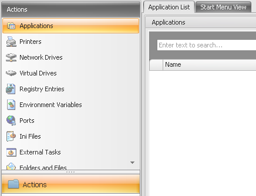

Use **Import Actions** button
 
Click **Next** button
 
Click **Browse** button
 
Select Sample applications
Click **OK** button

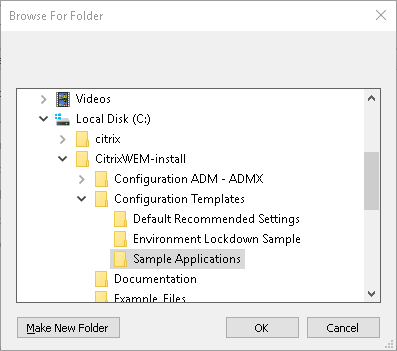
 
Select Applications check box and click **Next** button

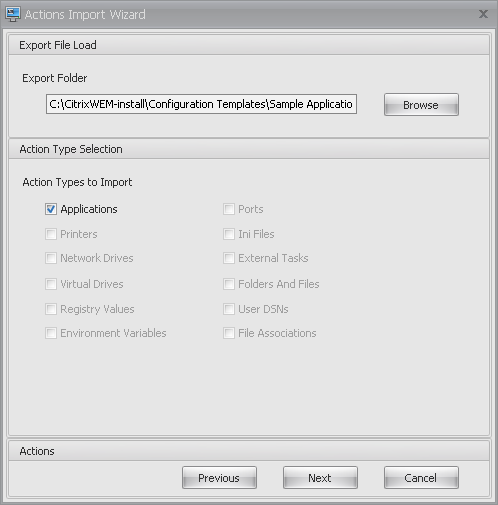 

Use **Select All** button and click **Next**

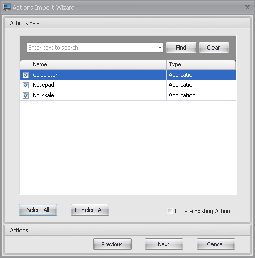 

Click **Import Actions** button
 
Click **Finish**
New applications appear in Console

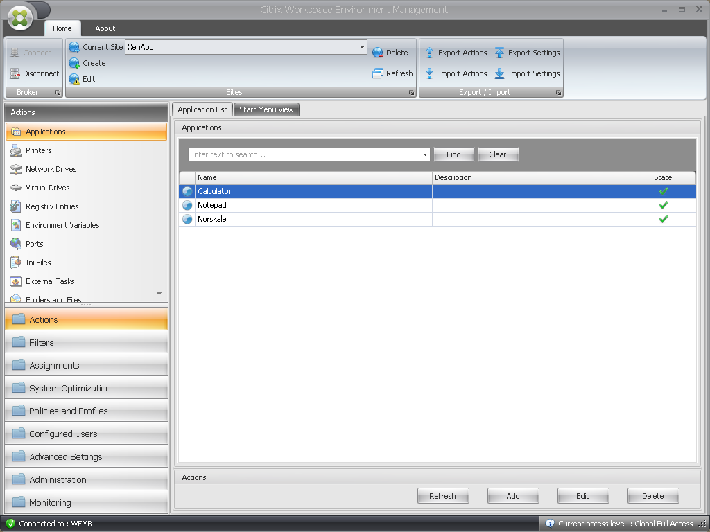
 
Select Network drives in Actions list

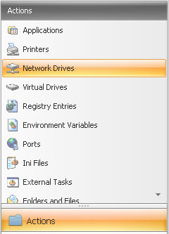 

Use **Add** button
 
You will create a public share
Enter information as shown

- Name: Public
- Description: Public share
- Target Path: \\DNA1\AppDNAOutput
- Network Drive State: Enabled

Select **Options** tab and fill information as shown

- Display Name: Public Share
- Self Healing: Enable Automatic Self-Healing
 
Click **OK** button

Click Add button and fill information as shown for a new file share

- Name: Personal Folder
- Target Path: \\DNA1\AppDNAOutput\%username%

Go to **Options** tab, and fill information as shown

- Display Name: Public Share
- Self Healing: Enable Automatic Self-Healing
 
Click **OK** button
Select Filters tab, then Conditions. 

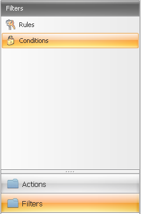

Click **Add** button, and fill information as shown

- Name: True if remote connection - Desktop student
- Filter Condition Type: Client IP Address Match
 
In Matching result field, you can add a range: 192.168.10.10;192.168.100.23-192.168.100.201
“;” is interpreted as an “or”
There are more than 75 different condition types, covering any customer technical needs

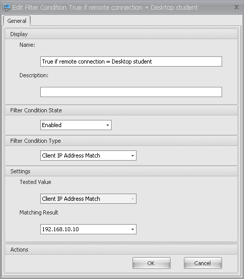

Click **OK** button
Select Rules

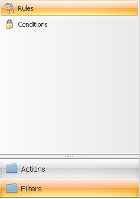

And click Add button
Fill information as shown

- Name: Student Desktop
- Filter Conditions: True if remote connection = Desktop student

Double click on Condition name or select it, and click on the right arrow to move it over to **Configured**
Click on **OK** button
Select Assignments tab

Double click on Domain users

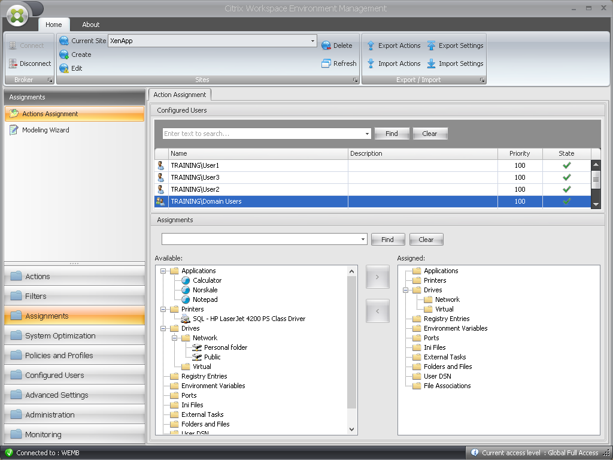

On “Available” list, you see all Actions set.

Choose public drive and click the right arrow
Choose letter P

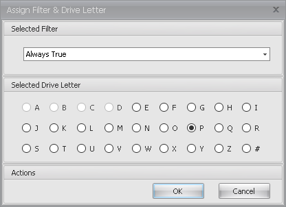

Click on **OK** button
Choose Personal folder, click on the right arrow 
Choose letter M
 

Click on **OK** button
Double click on User1, select Calculator icon and click on the right arrow
Accept “Always True” filter

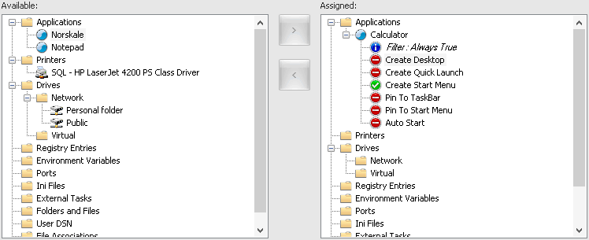

Right click on “Create Desktop” and select **Enable**

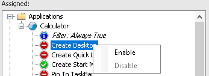

Right click on “Pin to Taskbar” and select **Enable**

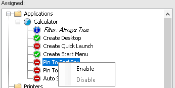
 
Double click on User2 and assign Notepad icon on Desktop and Start Menu

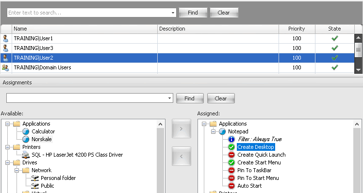

Log into the demo site using the address you had provided to you.

Log in as a user1
Click on Desktops tab and launch the Shared Desktop icon: this will connect to XA1
Check:
WEM agent splashscreen, right after login
WEM agent Icon in Systray  
Calculator Icon on desktop,
Use “vuemrsav.exe” to check WEM agent instructions
Connect to XA1 with user1 again and check logon speed
Log off

Connect to DNA1 and select Administration tab => users

 Click on **Refresh** button
Select Monitoring tab and click on **Refresh** button

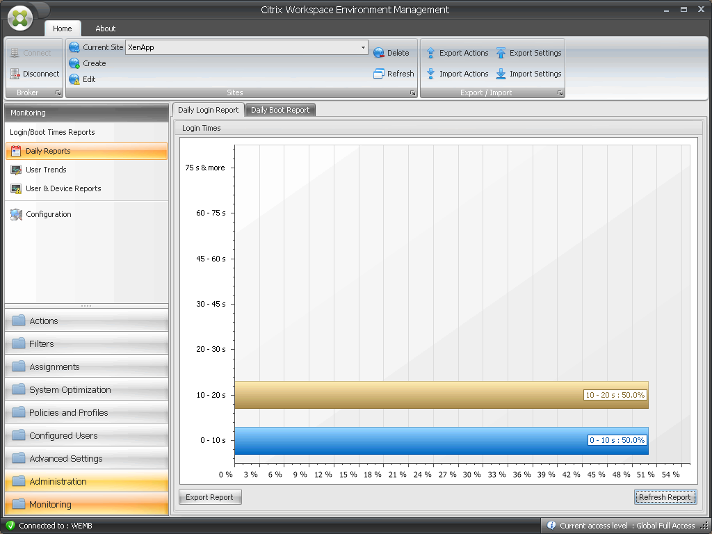
 
This window gives a report of daily logon times for every user on any Windows environment