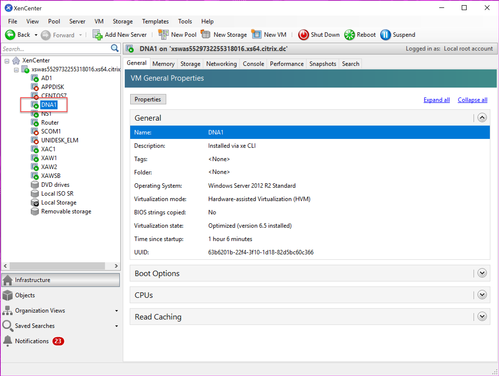

# **Training Overview** #

[Module 1 - CPU and RAM optimization](./Module1)

[Module 2 - Configuration Deployment](./Module2)

**Objective**

In this lab, you will discover how to build a snappy user experience, increase user density on any XenApp, XenDesktop environment, and learn how to manage a fast logon time (<15 s)
You will:

-	Learn how to configure CPU/RAM/IOPS optimizations
-	Learn how to replace user GPPs and login scripts

## Lab Environment ##
You should use this lab environment in the Demo Center:
*Application Virtualization with XenApp (MR 2.3)*

Connect as a demo admin, either through the StoreFront site to launch XenCenter or connect from XenCenter directly if you have it installed.

Start server DNA1. For this demo environment, this server runs the WEM services.

